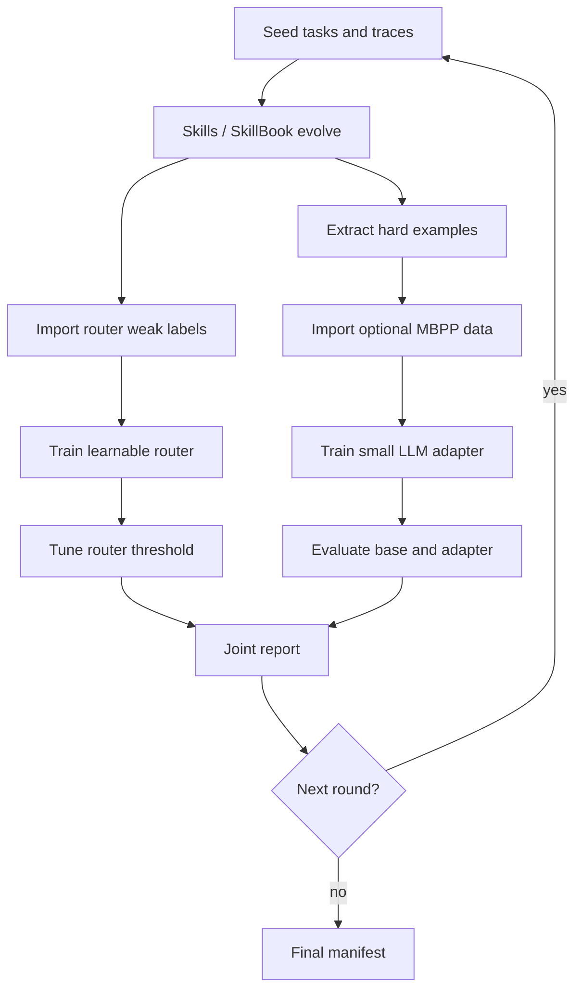

# Joint Evolver

`experiments/run_joint_evolver.py` is the end-to-end runner that wires the
previously separate evolver tracks into one reproducible loop.

## What it connects



## Dry-run

Use dry-run first. It writes the exact plan and checks paths without calling APIs
or training models.

```bash
python3 experiments/run_joint_evolver.py \
  --dry-run \
  --cycles 1 \
  --workdir runs/joint_evolver_smoke \
  --traces "data/traces/*.jsonl" \
  --skip-skills \
  --llm-train-data data/training_data.jsonl
```

## Full local run

The runner can execute all tracks in sequence:

```bash
python3 experiments/run_joint_evolver.py \
  --cycles 1 \
  --workdir runs/joint_evolver_v1 \
  --traces "data/traces/*.jsonl" \
  --router-base-model google/bert_uncased_L-2_H-128_A-2 \
  --router-epochs 8 \
  --router-max-fallback-rate 0.02 \
  --llm-train-data data/training_data.jsonl \
  --llm-base-model Qwen/Qwen2.5-Coder-0.5B-Instruct \
  --llm-epochs 3
```

## A800 notes

The A800 host needs proxy variables for GitHub and HuggingFace:

```bash
export http_proxy=http://127.0.0.1:1080
export https_proxy=http://127.0.0.1:1080
```

If HuggingFace is unavailable, the router track can still run with:

```bash
--router-base-model random-tiny-bert
```

The LLM track should use held-out eval data. A quick smoke run can use MBPP
generated by `experiments/import_mbpp_training_data.py`.

## Outputs

The runner writes:

- `joint_evolver_manifest.json`: command plan, step status, metrics, artifacts
- `round_*/`: per-round router, skills, LLM, and report artifacts

This gives us one file to inspect when asking whether skills, router, and LLM
training improved the system together.
